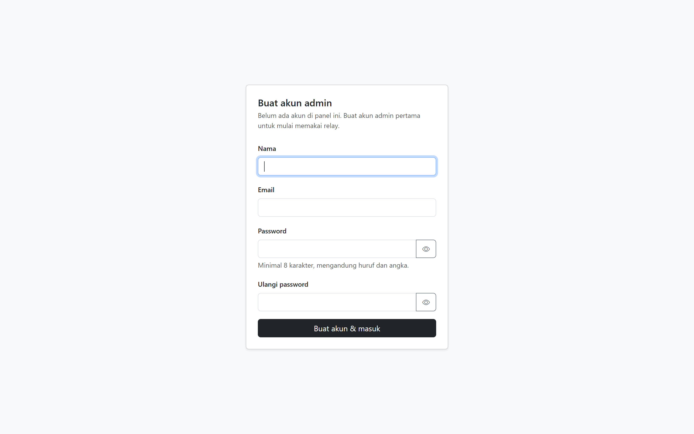
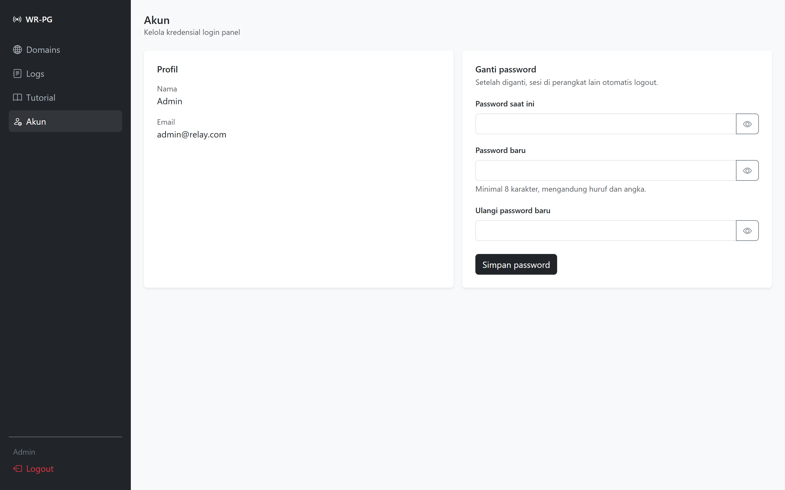

# Webhook Relay PG

Layanan perantara yang meneruskan notifikasi pembayaran dari payment gateway (Midtrans, Xendit & DOKU) ke banyak aplikasi — cukup dengan **satu akun payment gateway**.

---

## Screenshots

### Buat admin pertama


### Login


### Domains


### Tambah Domain


### Log


### Detail Log


### Akun


### Tutorial


---

## Fitur

- **Multi-app, satu akun PG** — satu akun Midtrans/Xendit/DOKU bisa dipakai banyak aplikasi
- **Tiga provider** — Midtrans, Xendit, dan DOKU dalam satu relay
- **Alias invoice (opsional)** — alias 3 karakter per domain untuk PG yang tidak mengembalikan metadata
- **Panel realtime** — semua tabel pakai DataTables server-side + AJAX; tambah/ubah/hapus lewat modal tanpa reload halaman
- **Auto refresh log** — opsional (default mati, pilihannya diingat di browser); saat aktif, daftar log menyegarkan diri tiap 10 detik tanpa kehilangan halaman & filter
- **Siap data besar** — paging, sorting, pencarian, dan filter dikerjakan di MySQL dengan kolom yang sudah di-index
- **Log terpusat** — pantau semua webhook dari semua aplikasi di satu tempat
- **Detail log** — lihat full payload JSON dan response dari target URL lewat modal
- **Retry manual** — kirim ulang webhook yang gagal langsung dari panel
- **Test webhook** — kirim dummy payload ke target URL untuk verifikasi koneksi
- **Filter lengkap** — domain, provider, status, dan rentang tanggal
- **Copy relay URL** — salin URL relay langsung dari panel domains
- **Bersihkan log** — hapus log lama dengan opsi sisakan 50 / 100 / 1000 terbaru
- **Setup admin pertama** — selama belum ada akun, panel menampilkan form registrasi; setelah itu form login
- **Ganti password** — lewat menu Akun; sesi di perangkat lain otomatis logout
- **Panel bisa dinonaktifkan** — relay tetap jalan meski panel di-disable via `.env`
- **Rate limiting login** — proteksi brute force dengan throttle & pencatatan log
- **Panel responsif** — Bootstrap 5, bisa diakses dari mobile

---

## Cara kerja

```
Midtrans/Xendit/DOKU
      │
      │  POST /api/webhook/relay-callback
      ▼
┌─────────────────────────────┐
│       Laravel Relay         │
│                             │
│  1. Deteksi provider dari   │
│     header & bentuk payload │
│  2. Baca domain identifier  │
│     (custom_field1 /        │
│      metadata.domain /      │
│      additional_info.domain)│
│  3. Cari domain di DB       │
│  4. Forward ke target URL   │
│  5. Catat log               │
└─────────────────────────────┘
      │
      ├──▶ App Laravel A (shop-a.com)
      ├──▶ App Laravel B (shop-b.com)
      └──▶ App Laravel C (shop-c.com)
```

---

## Instalasi

### Requirement

- PHP 8.2+
- Laravel 11
- MySQL / MariaDB
- Composer

### Langkah instalasi

```bash
# 1. Clone repo
git clone (url ini)
cd webhook-relay-payment-gateway

# 2. Install dependency
composer install

# 3. Copy env
cp .env.example .env
php artisan key:generate
```

**4. Konfigurasi database di `.env`:**

```env
DB_CONNECTION=mysql
DB_HOST=127.0.0.1
DB_PORT=3306
DB_DATABASE=webhook_relay
DB_USERNAME=root
DB_PASSWORD=
```

**5. Ganti path webhook URL di `routes/api.php` (jangan pake default ini)**

```php
// ❌ Jangan pakai path bawaan ini
Route::post('/webhook/relay-callback', ...);

// ✅ Ganti dengan path acak yang susah ditebak
Route::post('/webhook/relay-a8f3kx92mq', ...)->name('handleApi');
```

Gunakan kombinasi acak — huruf, angka, tanpa pola. Semakin panjang semakin aman. Kamu bisa generate string acak dengan:

```bash
php -r "echo bin2hex(random_bytes(8));"
```

> Simpan path ini baik-baik — ini satu-satunya cara Midtrans/Xendit/DOKU bisa mengirim webhook ke relay kamu. Jangan bagikan ke siapapun selain mendaftarkannya di dashboard payment gateway.

**6. Migrate**

```bash
php artisan migrate
php artisan serve
```

**7. Buat akun admin pertama**

Buka `http://localhost:8000`. Karena belum ada akun sama sekali, panel otomatis menampilkan **form registrasi**. Isi nama, email, dan password (minimal 8 karakter, mengandung huruf dan angka) — setelah tersimpan kamu langsung masuk ke panel.

Begitu satu akun sudah ada, halaman `/register` menutup diri sendiri dan mengarahkan ke form login. Tidak ada cara membuat akun kedua lewat panel.

> **Alternatif lewat seeder.** Kalau lebih suka akun dibuat dari CLI, ubah dulu kredensial di `database/seeders/AdminUserSeeder.php`, lalu jalankan `php artisan migrate --seed`. Sesudah itu halaman register otomatis tertutup.

---

## Konfigurasi .env

```env
# Aktifkan / nonaktifkan panel admin
# Jika false, panel tidak bisa diakses tapi webhook relay tetap jalan
PANEL_ENABLED=true
```

---

## Integrasi

### Midtrans

Daftarkan URL relay di api.php ke dashboard Midtrans sebagai **Payment Notification URL**:

```
(alamat url lengkap sesuai API)
```

Di setiap pembuatan transaksi, tambahkan `custom_field1` berisi domain yang sudah didaftarkan di panel:

```php
$params = [
    'transaction_details' => [
        'order_id'     => 'INV-001',
        'gross_amount' => 100000,
    ],
    'custom_field1' => 'nama-domain-kamu', // ← wajib diisi
];
```

---

### Xendit

Daftarkan URL di api.php ke dashboard Xendit sebagai webhook URL:

```
(alamat url lengkap sesuai API)
```

Di setiap pembuatan transaksi, tambahkan `metadata.domain` berisi domain yang sudah didaftarkan di panel:

```php
$params = [
    'external_id' => 'INV-001',
    'amount'      => 100000,
    'metadata'    => [
        'domain' => 'nama-domain-kamu', // ← wajib diisi
    ],
];
```

Relay mendeteksi `metadata.domain` secara **dinamis** — di mana pun lokasinya dalam payload (`data.metadata`, `qr_code.metadata`, atau top-level `metadata`), semua otomatis terbaca.

> **⚠️ Catatan untuk Xendit Invoice (invoice mode):** pada mode ini `metadata` **tidak ikut disertakan** di payload webhook, sehingga relay tidak punya cara mengenali aplikasi tujuan. Pakai endpoint yang meneruskan `metadata` (Payment Request, VA, atau QR).

---

### DOKU

Daftarkan URL di api.php ke dashboard DOKU sebagai **Notification URL**.

Relay mengenali DOKU dari header `Client-Id` + `Signature`, atau dari bentuk payload `order` + `transaction`.

Sisipkan domain di `additional_info.domain` saat membuat transaksi:

```php
$params = [
    'order' => [
        'invoice_number' => 'INV-001',
        'amount'         => 100000,
    ],
    'additional_info' => [
        'domain' => 'nama-domain-kamu', // ← wajib diisi
    ],
];
```

Sama seperti Xendit, `additional_info.domain` dicari secara **rekursif** — di mana pun letaknya dalam payload.

> **⚠️ Pastikan produk DOKU yang kamu pakai mengembalikan `additional_info`** di payload webhook. Kalau tidak ikut terkirim, relay tidak bisa mengenali aplikasi tujuan dan log akan bernilai `domain_not_found`.

**Header yang diteruskan.** Relay meneruskan `Client-Id`, `Request-Id`, `Request-Timestamp`, dan `Signature` apa adanya ke target URL, jadi aplikasi tujuan tetap bisa memverifikasi signature DOKU sendiri.

---

### Alias invoice (opsional)

Cara di atas — `custom_field1`, `metadata.domain`, `additional_info.domain` — selalu diutamakan. Alias ini cadangan untuk produk payment gateway yang tidak mengembalikan metadata di payload webhook-nya.

Setiap domain otomatis mendapat alias **3 karakter kapital** saat didaftarkan (terlihat di kolom *Alias* halaman Domains). Tempelkan di akhir nomor invoice, dipisah tanda hubung:

```php
$invoice = 'INV-08314';

// yang dikirim ke payment gateway
$externalId = $invoice . '-S8K';   // → INV-08314-S8K
```

Aturan pembacaannya sengaja ketat supaya tidak salah tangkap:

- Harus ada **tanda hubung** tepat sebelum 3 karakter terakhir. `INV08314S8K` tidak dianggap alias.
- Aliasnya harus benar-benar terdaftar. Kalau tidak ada di tabel domains, relay tidak menebak — log jadi `domain_not_found`.
- Hanya dipakai kalau identifier resmi tidak ditemukan di payload.
- Nomor invoice dikapitalkan dulu sebelum dicocokkan, jadi `inv-08314-s8k` tetap terbaca.

Alias diisi otomatis untuk semua domain yang sudah ada saat migrasi dijalankan. Kalau ada baris yang aliasnya masih kosong (misalnya disisipkan langsung lewat SQL), domain itu tetap berfungsi normal lewat identifier resmi — hanya jalur alias yang tidak tersedia untuknya, dan di panel kolom Alias-nya tertulis *belum ada*. Isi dengan:

```bash
php artisan domains:backfill-alias
```

Alias juga terisi sendiri begitu domain tersebut disimpan lewat panel.

> **⚠️ Aplikasi tujuan menerima nomor invoice lengkap dengan aliasnya** (`INV-08314-S8K`), karena relay meneruskan payload apa adanya. Potong 4 karakter terakhir saat mencocokkan ke database, atau simpan apa adanya — yang penting konsisten.

---

## Panel

### Domains

Tabel domain memakai DataTables server-side. Pencarian, sorting, paging, dan filter (provider & status aktif) semuanya dikirim ke server — bukan difilter di browser — jadi tetap ringan berapa pun jumlah datanya.

Setiap domain otomatis mendapat **alias 3 karakter** yang tampil di kolom *Alias* (lihat bagian [Alias invoice](#alias-invoice-opsional)).

Tambah, ubah, dan hapus domain dilakukan lewat modal AJAX; tabel langsung menyegarkan diri tanpa reload halaman. Domain identifier diambil otomatis dari host `target_url`, dan kombinasi **domain + provider** harus unik (satu domain boleh punya entri terpisah untuk Midtrans, Xendit, dan DOKU).

### Logs

Sama-sama server-side, dengan filter domain, provider, status, dan rentang tanggal. Baris di-klik **Detail** untuk melihat payload JSON penuh, response, dan pesan error — lalu bisa langsung **Kirim ulang** dari modal yang sama.

Toggle **Auto refresh** di kanan atas menyalakan penyegaran otomatis tiap 10 detik. Default-nya **mati**, dan pilihanmu disimpan di `localStorage` browser jadi tetap sama saat halaman dibuka lagi. Saat aktif, refresh berhenti sendiri ketika tab tidak dilihat.

**Bersihkan log** menghapus semua log di luar N terbaru (50 / 100 / 1000).

### Akun

Menu **Akun** menampilkan profil dan form ganti password. Password baru wajib minimal 8 karakter, mengandung huruf dan angka, berbeda dari password lama, dan dikonfirmasi ulang. Setelah diganti, sesi di perangkat/browser lain otomatis logout — sesi yang sedang dipakai tetap hidup.

---

## Data dummy untuk testing

Untuk mencoba paging, filter, dan retry tanpa menunggu webhook asli:

```bash
php artisan db:seed --class=DummyDataSeeder
```

Opsi lewat environment variable:

| Variable | Default | Keterangan |
|----------|---------|------------|
| `DUMMY_RESET` | — | Isi `1` untuk menghapus semua domain & log lama dulu |
| `DUMMY_DOMAINS` | 24 | Jumlah domain yang dibuat |
| `DUMMY_LOGS` | 3000 | Jumlah log yang dibuat |

```bash
DUMMY_RESET=1 DUMMY_LOGS=20000 php artisan db:seed --class=DummyDataSeeder
```

Domain dibagi rata ke tiga provider (plus beberapa yang nonaktif) supaya setiap opsi filter ada isinya. Log tersebar 30 hari ke belakang dengan campuran status sukses / gagal / domain tidak ditemukan, dan payload-nya mengikuti bentuk asli tiap provider — jadi tombol retry pun bisa diuji.

Seeder ini menolak jalan saat `APP_ENV=production`, dan sengaja **tidak** didaftarkan di `DatabaseSeeder`, jadi `php artisan migrate --seed` tetap hanya membuat akun admin.

---

## Testing

```bash
php artisan test
```

Test memakai database terpisah yang di-set di `phpunit.xml`:

```xml
<env name="DB_CONNECTION" value="mysql"/>
<env name="DB_DATABASE" value="webhook_relay_pg_test"/>
```

> **Penting:** buat database itu dulu (`CREATE DATABASE webhook_relay_pg_test;`) dan jangan pernah mengarahkannya ke database development. `RefreshDatabase` menjalankan `migrate:fresh`, jadi database yang ditunjuk akan dikosongkan setiap kali test jalan.

Yang dicakup: alur registrasi admin pertama, ganti password, endpoint DataTables (bentuk response, filter, paging), CRUD domain via AJAX, prune log, serta relay webhook DOKU.

---

## Performa & indexing

Panel dirancang untuk tetap responsif saat log sudah menumpuk:

- **Server-side processing** — DataTables hanya menarik satu halaman data per request, bukan seluruh tabel.
- **Index** — `webhook_logs` di-index pada `created_at`, `(domain_id, id)`, `(status, id)`, `(provider, id)`, `(domain_id, status, id)`, `custom_field1`, dan `event_type`. Setiap sorting berakhir di `id` supaya cocok dengan index komposit tersebut.
- **Pencarian prefix** — kolom ber-index dicari dengan `LIKE 'x%'`, bukan `%x%`, supaya index tetap terpakai.
- **Hitungan baris** — jumlah total log memakai estimasi InnoDB dari `information_schema` bila baris sudah lebih dari 500 ribu, karena `COUNT(*)` penuh di setiap request akan memberatkan tabel sebesar itu.
- **Prune** — penghapusan log memakai batas `id` (primary key), bukan `WHERE id NOT IN (...)` berisi ribuan nilai.
- **Whitelist kolom** — kolom sorting & filter dibatasi daftar tetap di controller, jadi parameter dari browser tidak bisa dipakai menyusup ke query.

---

## Arti status log

| Status | Keterangan | Solusi |
|--------|------------|--------|
| `success` | Webhook berhasil diteruskan ke target URL | — |
| `failed` | Target URL tidak merespons atau mengembalikan error | Cek apakah target URL aktif dan merespons 2xx |
| `domain_not_found` | Domain identifier tidak terdaftar atau nonaktif | Pastikan domain terdaftar di panel dan statusnya aktif |

---

## Keamanan

- Registrasi hanya terbuka selama belum ada satu pun akun, dicek ulang di dalam transaksi dengan row lock agar dua request bersamaan tidak bisa sama-sama membuat admin pertama
- Rate limiting login: 3 percobaan per menit per IP; registrasi 5 per menit
- Setiap percobaan login yang melebihi batas dicatat di `storage/logs/laravel.log`
- Ganti password mewajibkan password lama, dan mematikan sesi di perangkat lain
- Domain yang nonaktif otomatis ditolak
- Panel bisa dinonaktifkan sepenuhnya via `PANEL_ENABLED=false` tanpa mengganggu relay
- Relay **tidak** memverifikasi signature — verifikasi dilakukan aplikasi tujuan, dan header signature asli tiap provider diteruskan untuk keperluan itu

---

## Aturan penggunaan

- Domain identifier harus **unik** per provider dan konsisten di semua transaksi
- Jangan ubah domain identifier jika sudah ada transaksi berjalan
- Target URL harus **dapat diakses publik** (bukan localhost)
- Target URL harus merespons dengan HTTP **2xx** agar log tercatat sukses
- Relay tidak menyimpan data kartu atau informasi sensitif pembayaran

---

## Struktur project

```
app/
├── Http/
│   ├── Controllers/
│   │   ├── Auth/LoginController.php
│   │   ├── Auth/RegisterController.php
│   │   ├── Panel/AccountController.php
│   │   ├── Panel/DomainController.php
│   │   ├── Panel/LogController.php
│   │   └── Webhook/RelayController.php
│   └── Middleware/
│       └── PanelEnabled.php
├── Models/
│   ├── Domain.php
│   └── WebhookLog.php
└── Services/
    ├── MidtransVerifier.php
    ├── XenditVerifier.php
    └── WebhookForwarder.php

database/
├── factories/
│   ├── DomainFactory.php
│   └── WebhookLogFactory.php
└── seeders/
    ├── AdminUserSeeder.php
    └── DummyDataSeeder.php

resources/views/
├── auth/
│   ├── login.blade.php
│   └── register.blade.php
├── layouts/
│   └── app.blade.php
├── partials/
│   ├── head-assets.blade.php   ← Bootstrap 5, Bootstrap Icons, DataTables CSS
│   └── js-assets.blade.php     ← jQuery, DataTables, Bootstrap, SweetAlert2 + helper global
└── panel/
    ├── disabled.blade.php
    ├── tutorial.blade.php
    ├── account/
    │   └── edit.blade.php
    ├── domains/
    │   ├── index.blade.php
    │   ├── create.blade.php
    │   ├── edit.blade.php
    │   └── test.blade.php
    └── logs/
        ├── index.blade.php
        └── show.blade.php
```

### Aset frontend

Semua CDN (Bootstrap 5, Bootstrap Icons, jQuery, DataTables, SweetAlert2) berada di dua partial: `partials/head-assets.blade.php` dan `partials/js-assets.blade.php`. Blade baru cukup meng-`@include` keduanya — tidak perlu menyalin tag `<script>`/`<link>` lagi.

`js-assets` juga menyediakan helper global yang dipakai lintas halaman:

| Helper | Kegunaan |
|--------|----------|
| `notify(pesan, icon)` | Toast SweetAlert di pojok kanan atas |
| `confirmAction({...})` | Dialog konfirmasi, mengembalikan Promise boolean |
| `escapeHtml(v)` | Escape nilai sebelum masuk ke render DataTables |
| `providerBadge(p)` | Badge berwarna sesuai provider |
| `DT_LANG` | Terjemahan Indonesia untuk DataTables |
| `data-toggle-password="#id"` | Tombol mata untuk menampilkan/menyembunyikan password |

---

## Lisensi

MIT License — bebas digunakan dan dimodifikasi.
