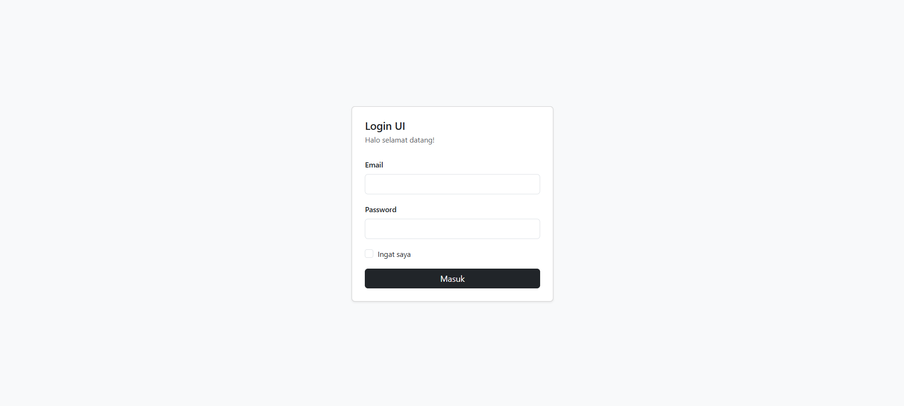
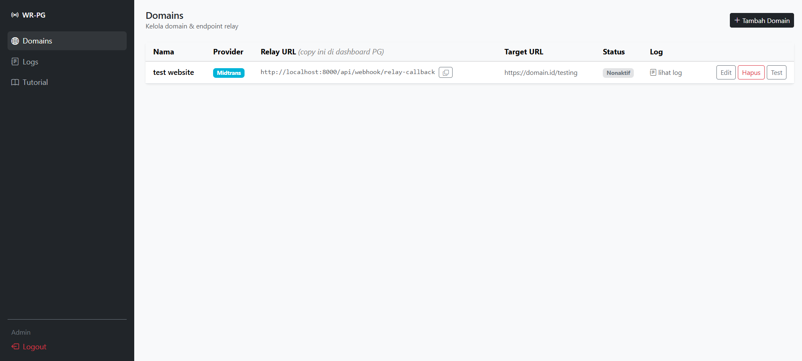
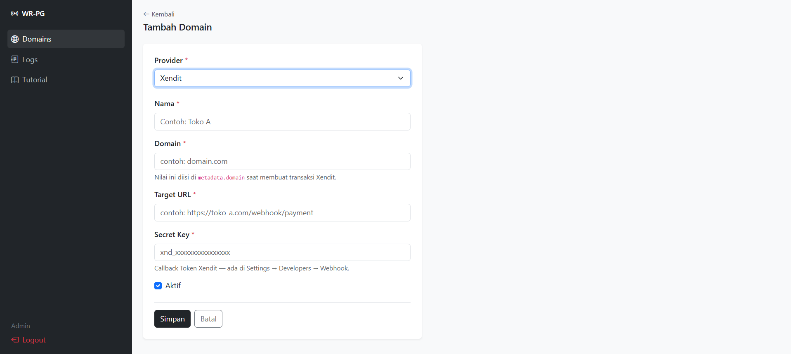
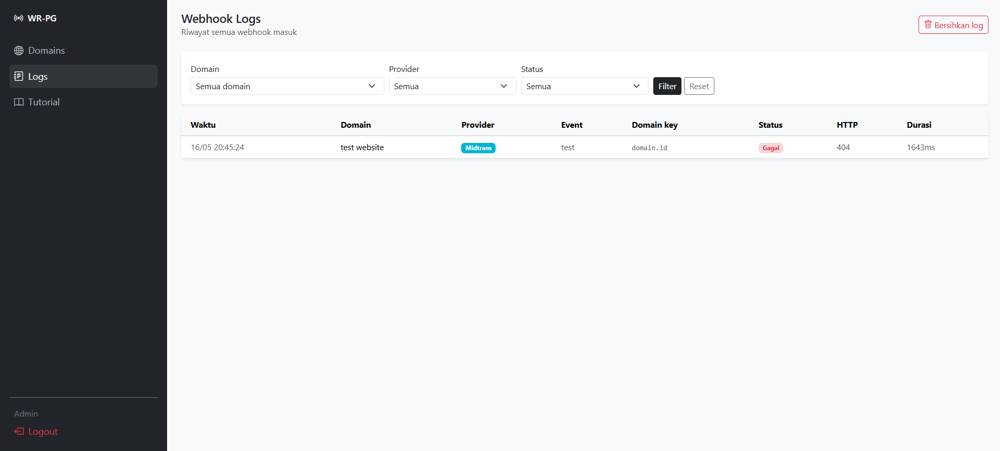
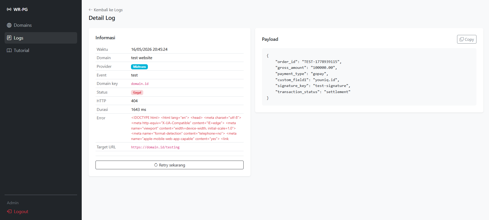
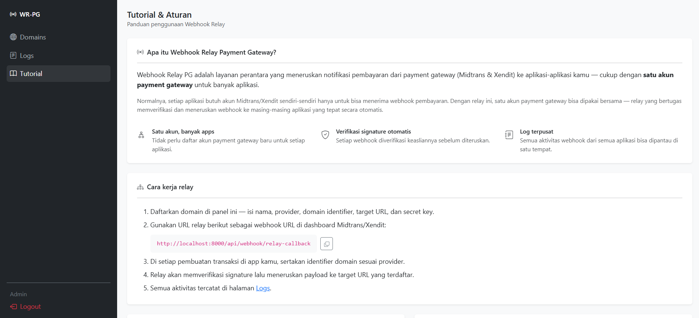
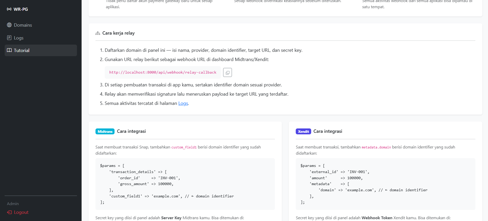
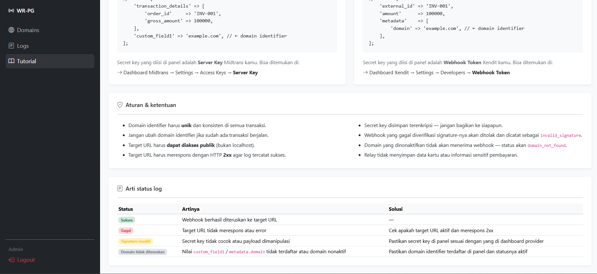

# Webhook Relay PG

Layanan perantara yang meneruskan notifikasi pembayaran dari payment gateway (Midtrans & Xendit) ke banyak aplikasi — cukup dengan **satu akun payment gateway**.

---

## Screenshots

### Login


### Domain


### Tambah Domain


### Log


### Detail Log


### Tutorial







---

## Fitur

- **Multi-app, satu akun PG** — satu akun Midtrans/Xendit bisa dipakai banyak aplikasi
- **Verifikasi signature otomatis** — Midtrans (SHA512) & Xendit (X-CALLBACK-TOKEN)
- **Log terpusat** — pantau semua webhook dari semua aplikasi di satu tempat
- **Detail log** — lihat full payload JSON dan response dari target URL
- **Retry manual** — kirim ulang webhook yang gagal langsung dari panel
- **Test webhook** — kirim dummy payload ke target URL untuk verifikasi koneksi
- **Copy relay URL** — salin URL relay langsung dari panel domains
- **Bersihkan log** — hapus log lama dengan opsi sisakan 50 / 100 / 1000 terbaru
- **Panel bisa dinonaktifkan** — relay tetap jalan meski panel di-disable via `.env`
- **Rate limiting login** — proteksi brute force dengan throttle & pencatatan log
- **Panel responsif** — Bootstrap 5, bisa diakses dari mobile

---

## Cara kerja

```
Midtrans/Xendit
      │
      │  POST /api/webhook/relay
      ▼
┌─────────────────────────────┐
│       Laravel Relay         │
│                             │
│  1. Baca custom_field1 /    │
│     metadata.domain         │
│  2. Cari domain di DB       │
│  3. Validasi signature      │
│  4. Forward ke target URL   │
│  5. Catat log               │
└─────────────────────────────┘
      │
      ├──▶ App Laravel A (shop-a.com)
      ├──▶ App Laravel B (shop-b.com)
      └──▶ App Laravel C (shop-c.com)
```

---

## Instalasi

### Requirement

- PHP 8.2+
- Laravel 11
- MySQL / MariaDB
- Composer

### Langkah instalasi

```bash
# 1. Clone repo
git clone (url ini)
cd webhook-relay-payment-gateway

# 2. Install dependency
composer install

# 3. Copy env
cp .env.example .env
php artisan key:generate
```

**4. Konfigurasi database di `.env`:**

```env
DB_CONNECTION=mysql
DB_HOST=127.0.0.1
DB_PORT=3306
DB_DATABASE=webhook_relay
DB_USERNAME=root
DB_PASSWORD=
```

**5. Ganti path webhook URL di `routes/api.php` (jangan pake default ini)**

```php
// ❌ Jangan pakai path bawaan ini
Route::post('/webhook/relay', ...);

// ✅ Ganti dengan path acak yang susah ditebak
Route::post('/webhook/relay-a8f3kx92mq', ...)->name('handleApi');
```

Gunakan kombinasi acak — huruf, angka, tanpa pola. Semakin panjang semakin aman. Kamu bisa generate string acak dengan:

```bash
php -r "echo bin2hex(random_bytes(8));"
```

> Simpan path ini baik-baik — ini satu-satunya cara Midtrans/Xendit bisa mengirim webhook ke relay kamu. Jangan bagikan ke siapapun selain mendaftarkannya di dashboard payment gateway.

**6. Ubah kredensial admin default di `database/seeders/AdminUserSeeder.php` sebelum migrate:**

```php
User::create([
    'name'     => 'Nama Kamu', // ← ubah nama
    'email'    => 'email@domain.com',    // ← email untuk login, bebas
    'password' => Hash::make('isipasswordkamu'), // ← pastikan password panjang & rumit
]);
```

```bash
# 7. Migrate & seed
php artisan migrate --seed

# 8. Jalankan
php artisan serve
```

Akses panel di `http://localhost:8000` dengan kredensial yang sudah kamu set di seeder.

> Gunakan email & password seeder tadi.

---

## Konfigurasi .env

```env
# Aktifkan / nonaktifkan panel admin
# Jika false, panel tidak bisa diakses tapi webhook relay tetap jalan
PANEL_ENABLED=true
```

---

## Integrasi

### Midtrans

Daftarkan URL relay di api.php ke dashboard Midtrans sebagai **Payment Notification URL**:

```
(alamat url lengkap sesuai API)
```

Di setiap pembuatan transaksi, tambahkan `custom_field1` berisi domain yang sudah didaftarkan di panel:

```php
$params = [
    'transaction_details' => [
        'order_id'     => 'INV-001',
        'gross_amount' => 100000,
    ],
    'custom_field1' => 'nama-domain-kamu', // ← wajib diisi
];
```

Secret key yang diisi di panel adalah **Server Key** Midtrans.
Lokasi: Dashboard Midtrans → Settings → Access Keys → **Server Key**

---

### Xendit

Daftarkan URL di api.php ke dashboard Xendit sebagai webhook URL:

```
(alamat url lengkap sesuai API)
```

Di setiap pembuatan transaksi, tambahkan `metadata.domain` berisi domain yang sudah didaftarkan di panel:

```php
$params = [
    'external_id' => 'INV-001',
    'amount'      => 100000,
    'metadata'    => [
        'domain' => 'nama-domain-kamu', // ← wajib diisi
    ],
];
```

Secret key yang diisi di panel adalah **Webhook Token** Xendit.
Lokasi: Dashboard Xendit → Settings → Developers → **Webhook Token**

---

## Arti status log

| Status | Keterangan | Solusi |
|--------|------------|--------|
| `success` | Webhook berhasil diteruskan ke target URL | — |
| `failed` | Target URL tidak merespons atau mengembalikan error | Cek apakah target URL aktif dan merespons 2xx |
| `invalid_signature` | Secret key tidak cocok atau payload dimanipulasi | Pastikan secret key di panel sesuai dengan yang di dashboard provider |
| `domain_not_found` | Domain identifier tidak terdaftar atau nonaktif | Pastikan domain terdaftar di panel dan statusnya aktif |

---

## Keamanan

- Rate limiting login: 5 percobaan per menit per IP
- Setiap percobaan login yang melebihi batas dicatat di `storage/logs/laravel.log`
- Validasi signature per provider sebelum webhook diteruskan
- Domain yang nonaktif otomatis ditolak
- Panel bisa dinonaktifkan sepenuhnya via `PANEL_ENABLED=false` tanpa mengganggu relay

---

## Aturan penggunaan

- Domain identifier harus **unik** dan konsisten di semua transaksi
- Jangan ubah domain identifier jika sudah ada transaksi berjalan
- Target URL harus **dapat diakses publik** (bukan localhost)
- Target URL harus merespons dengan HTTP **2xx** agar log tercatat sukses
- Secret key jangan dibagikan ke siapapun
- Relay tidak menyimpan data kartu atau informasi sensitif pembayaran

---

## Struktur project

```
app/
├── Http/
│   ├── Controllers/
│   │   ├── Auth/LoginController.php
│   │   ├── Panel/DomainController.php
│   │   ├── Panel/LogController.php
│   │   └── Webhook/RelayController.php
│   └── Middleware/
│       └── PanelEnabled.php
├── Models/
│   ├── Domain.php
│   └── WebhookLog.php
└── Services/
    ├── MidtransVerifier.php
    ├── XenditVerifier.php
    └── WebhookForwarder.php

resources/views/
├── auth/
│   └── login.blade.php
├── layouts/
│   └── app.blade.php
└── panel/
    ├── disabled.blade.php
    ├── tutorial.blade.php
    ├── domains/
    │   ├── index.blade.php
    │   ├── create.blade.php
    │   ├── edit.blade.php
    │   └── test.blade.php
    └── logs/
        ├── index.blade.php
        └── show.blade.php
```

---

## Lisensi

MIT License — bebas digunakan dan dimodifikasi.
